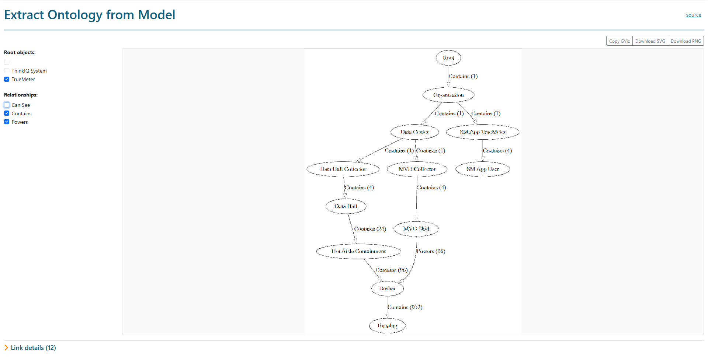

# Ontology Extraction from a SMIP Model

<b>Fig.1 - Sample Ontology</b>

## Some Benefits

- ontologies can keep AI bots from making stuff up
- ontologies extracted using this script are a reflection of what is modeled. modeling errors and inconsistencies will stick out.
- an ontology is an excellent communication tool of how things are meant to be modeled

## Recent Improvements

- root object and relationship toggles to focus the view on what matters
- download and copy buttons for the generated DOT source
- hide controls and CSV download of the tree for downstream use

Paste the generated DOT into a Graphviz fiddle to render and tweak online:

- [GraphvizOnline (dreampuf)](https://dreampuf.github.io/GraphvizOnline/) — live DOT editor with instant rendering, share URLs, multiple engines, SVG/PNG export
- [Edotor](https://edotor.net/) — clean UI, supports multiple engines
- [Graphviz Visual Editor (magjac)](http://magjac.com/graphviz-visual-editor/) — more interactive, lets you edit nodes graphically

## Code First vs. Model First

One could argue that in object-oriented (OO) programming (code first) things always yield to an ontology, because in OO usage and yielding to an ontology is implied.

If your code is scripted in nature (javascript or python...), you could reflect on the model to infer an ontology for above stated purposes.

In the SMIP it is very easy to simply model away (model first). It would be good practice to reflect on this after a while to discover the rules followed, review them, and then enforce such ontological rules more strongly moving forward.